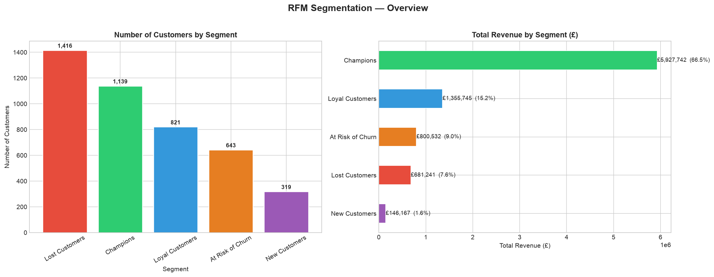
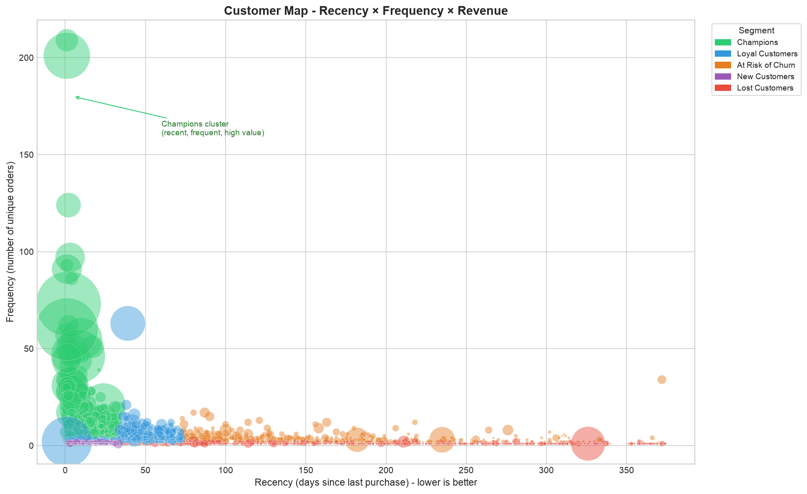
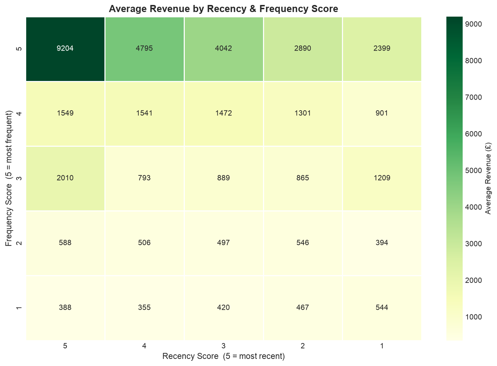

# RFM Customer Segmentation : E-Commerce Analysis


## Overview

This project applies **RFM analysis** (Recency, Frequency, Monetary) 
to segment customers of a UK-based e-commerce store and deliver 
**actionable business recommendations** for each segment.

The analysis transforms 541,910 raw transactions into a clear 
customer intelligence report, identifying which customers to 
retain, reactivate, or let go.

---

## Business Problem

E-commerce businesses often treat all customers the same :
same newsletters, same promotions, same communication. 
This is inefficient and costly.

**Key question answered by this analysis :**
> *"Who are our most valuable customers, which ones are leaving, 
> and what should we do about it ?"*

---

## Dataset

| Property | Value                                                                                          |
|---|------------------------------------------------------------------------------------------------|
| Source | [Online Retail II, UCI / Kaggle](https://www.kaggle.com/datasets/mashlyn/online-retail-ii-uci) |
| Period | December 2009 – December 2011                                                                  |
| Raw transactions | 541,910                                                                                        |
| Clean transactions | 397,885                                                                                        |
| Unique customers | 4,338                                                                                          |
| Country | United Kingdom                                                                                 |

---

## Methodology

### 1. Data Cleaning
- Removed rows with missing `Customer ID` (~135,000 rows)
- Filtered out returns (negative quantities)
- Removed zero-price transactions
- Converted dates to datetime format

### 2. RFM Metrics Computation

| Metric | Definition | Interpretation |
|---|---|---|
| **Recency (R)** | Days since last purchase | Lower = better |
| **Frequency (F)** | Number of unique orders | Higher = better |
| **Monetary (M)** | Total revenue generated | Higher = better |

### 3. Scoring
Each metric is scored from **1 to 5** using quantile-based binning.
Recency is reversed (score 5 = most recent customer).

### 4. Segmentation
Five business segments defined from R and F scores :

| Segment | Condition | Strategy |
|---|---|---|
| 🟢 Champions | R≥4 & F≥4 | Reward & retain |
| 🔵 Loyal Customers | R≥3 & F≥3 | Upsell & cross-sell |
| 🟠 At Risk of Churn | R≤2 & F≥3 | Reactivation campaign |
| 🟣 New Customers | R≥4 & F≤2 | Onboarding & 2nd purchase |
| 🔴 Lost Customers | Others | Selective win-back |

---

## Key Results

| Segment | Customers | % Base | Revenue | % Revenue |
|---|---|---|---|---|
| Champions | 1,139 | **26%** | £5,891,258 | **66%** |
| Loyal Customers | 821 | 19% | £1,384,217 | 15% |
| At Risk of Churn | 643 | 15% | £893,464 | 10% |
| Lost Customers | 1,416 | 33% | £614,823 | 7% |
| New Customers | 319 | 7% | £150,874 | 2% |

### Key Insight
> **26% of customers (Champions) generate 66% of total revenue.**
> Losing this segment would mean losing two-thirds of the business.
> Protecting Champions is the #1 business priority.

---

## Visualisations

### Figure 1. Segment Distribution & Revenue Share


### Figure 2. Customer Map (Recency × Frequency × Revenue)


### Figure 3. Average Revenue Heatmap by RFM Score


---

## Business Recommendations

### 🟢 Champions : Protect at all costs
- Launch an exclusive VIP programme (early access, free shipping, gifts)
- Personalised communication : they deserve differentiated treatment
- Monitor their NPS quarterly : their satisfaction is your most critical KPI
- Turn them into brand ambassadors through a referral programme

### 🟠 At Risk of Churn : Act immediately
- Launch a reactivation campaign within **30 days** (before they become Lost)
- Personalised discount (10-15%) with message : *"We miss you"*
- Cost of acquiring a new customer = **5× the cost of retaining an existing one**

### 🔵 Loyal Customers : Move them up
- Points or rewards programme with thresholds (bonus at 10th order)
- Targeted cross-selling based on purchase history
- Estimated additional revenue if 20% convert to Champions : **+£350,000**

### 🔴 Lost Customers : Be selective
- Filter by historical revenue : customers > £500 worth a win-back attempt
- Customers < £100 historical : abandon — reactivation cost exceeds expected return
- Strong offer (20%+) for selected profiles only

### 🟣 New Customers : Nurture the relationship
- Onboarding sequence to encourage the 2nd purchase (highest churn risk point)
- Welcome series with product education and social proof

---

## 🛠️ Tech Stack

````
Python 3.10+
├── pandas — data manipulation & RFM computation
├── numpy — numerical operations
├── scikit-learn — quantile scoring (qcut)
├── matplotlib — custom visualisations
└── seaborn — heatmap & statistical plots
````
---

## ⚙️ How to Run

```bash
# 1. Clone the repository
git clone https://github.com/Kaabi-ml/rfm-customer-segmentation
cd rfm-customer-segmentation

# 2. Install dependencies
pip install -r requirements.txt

# 3. Download the dataset
# https://www.kaggle.com/datasets/mashlyn/online-retail-ii-uci
# Place online_retail_II.csv in the data/ folder

# 4. Run the notebook
jupyter notebook rfm_analysis.ipynb
```

---

## Requirements

```
pandas>=2.0.0
numpy>=1.24.0
scikit-learn>=1.3.0
matplotlib>=3.7.0
seaborn>=0.12.0
jupyter>=1.0.0
```

---

## ⚠️ Limitations

- RFM scores are quantile-based, sensitive to extreme values
- Segmentation is static, a rolling 6-month analysis would yield richer insights
- No customer satisfaction or return data available
- UK-only dataset, segmentation thresholds may differ for other markets

---

## 👤 Author

**Amin Kaabi**
L3 MIAGE — Université Toulouse 1 Capitole
Data Science & Analytics Freelance

[](https://github.com/Kaabi-ml)
[](www.linkedin.com/in/amin-kaabi-74308a278)

---

## 📄 License

This project is open source and available under the 
[MIT License](LICENSE).